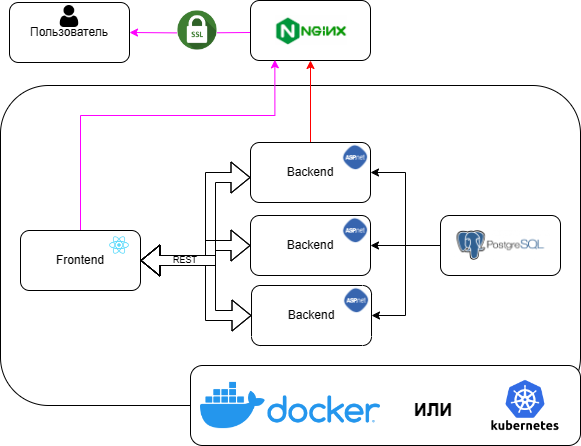

# CyberBloomBackend

Технологии:
* ASP.NET
* PostgreSQL
* Docker + Compose
* Nginx
* [CI/CD](.gitea/workflows/gitea-push-docker.yml)

# Схема


# Схема БД


# Docker

```bash
docker run -d -p 82:80 \
--name CyberBloomBackend \
--restart=always \
-e CONNECTION_STRING='Host=192.168.0.94;Port=5432;Database=backend;Username=prod;Password=' \
-e TZ=Europe/Moscow \
git.zetcraft.ru/cybebloom/cybebloombackend:main
```

# Docker Compose

```yml
version: '3.3'
services:
    cyberbloomhackaton:
        ports:
            - '82:80'
        container_name: CyberBoom
        restart: always
        environment:
            - CONNECTION_STRING=Host=192.168.0.94;Port=5432;Database=backend;Username=prod;Password=
            - TZ=Europe/Moscow
            - Google:ClientId=1074677274720-anq59r07nlu1nh7r444pg7llsts>
            - Google:ClientSecret=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
        volumes:
            - filesvolume:/app/cyber-boom-files
        image: 'git.zetcraft.ru/cybebloom/cybebloombackend:main'
volumes:
  filesvolume:
```